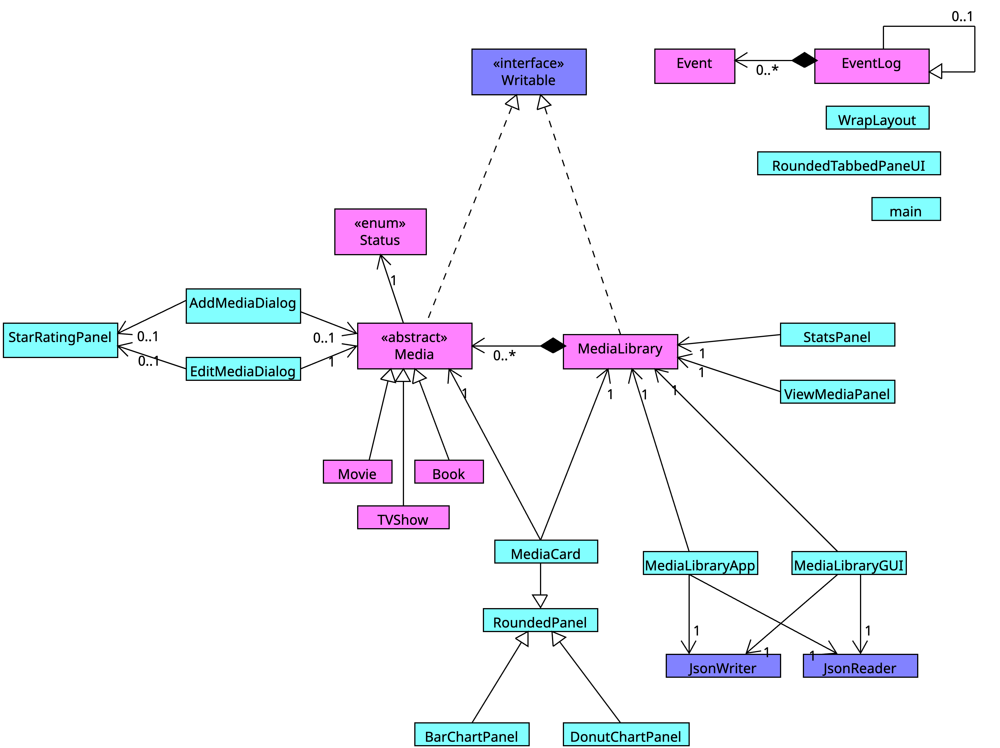

# MediaLibrary
*A desktop application for tracking books, movies, and TV shows in one place*

## About
I always find myself starting a new show, saving a book for later, or cozying up to a new movie. As a result, my Notes app has devolved into a clunky and disorganized log of all my new interests; I can never remember what I finished, what I dropped, or why I loved something. **MediaLibrary** was created to solve this problem by acting as a personal tracker built specifically for books, movies, and TV that goes beyond simple logging. 

Bookworms and movie/TV enthusiasts like myself who juggle extensive "To be Read" piles or watch lists and want a more organized way to log their media consumption will benefit from this app. With **MediaLibrary**, users can:
- manage media collections with want to read/watch lists
- track consumption status
- document ratings and reviews
- generate simple user statistics about consumption

## User Stories

- As a user, I want to be able to **add a media item to my library** (book/movie/TV show) and specify its title, status, and genre
- As a user, I want to be able to **view a list of all my media items**, and all my media items **filtered by status and media type** 
- As a user, I want to be able to **update the status and progress for a media item** "Want to Read", "Finished", "Currently Reading/Watching", or "Did Not Finish"
- As a user, I want to **assign or update a numerical rating (e.g., 1–5 stars)** to a finished item and **save a written review**.
- As a user, I want to be able to see my **average rating** across all finished items of a media type
- As a user, I want to be able to see the **percentage of items I have finished** relative to everything I have added to the library
- As a user, when I select the quit option from the main menu, I want to be prompted to **save my media library** to file and have the option to do so or not
- As a user, when I start the application, I want to be given the option to **load my media library** from file

## Instructions for End User
- You can view the **library panel** that displays the media items that have **already been added** to your media library upon opening the application
- Satisfying the first user criteria.. you can add a media item to your library by pressing the "Add Media" button on the top right corner 
- Satisfying the second user criteria.. you can **filter the view by status and media type** by selecting your filters from the dropdown menu at the top of the **library panel**
- You can locate my visual component—a bar graph and pie chart—by clicking the tab labelled "Stats"
- You can save the state of my application upon close by selecting "yes" to saving your library
- You can load the state of my application upon entering your username at startup and selecting "yes" to loading your saved library
- You can edit a media item by pressing on the entry in the library panel
- You can choose a cover image for a media item by right-clicking on the media item entry in the library panel

## Phase 4: Task 2
Example output:  
    Fri Mar 27 03:35:43 PDT 2026  
    Filtered by type: Book  
    Fri Mar 27 03:35:48 PDT 2026  
    Filtered by type and status: Book and WANT_TO  
    Fri Mar 27 03:35:49 PDT 2026  
    Filtered by type and status: Book and IN_PROGRESS  
    Fri Mar 27 03:35:51 PDT 2026  
    Filtered by type: Book  
    Fri Mar 27 03:36:10 PDT 2026   
    Number of seasons of "SLOMW" updated to: 4  
    Fri Mar 27 03:36:29 PDT 2026  
    Rating of "Discrete Mathematics" updated to: 1 stars  
    Fri Mar 27 03:36:29 PDT 2026  
    Review of "Discrete Mathematics" updated to: Even worse than I remember  
    Fri Mar 27 03:40:28 PDT 2026  
    Movie added to library: Moana     

## Phase 4: Task 3

To refactor, I might consider extracting a **shared abstract superclass** for `AddMediaDialog` and `EditMediaDialog`. Looking at the UML diagram, these two classes are not related by any subtyping relationship despite sharing the vast majority of their structure: both have the same labeled row layout, the same type-specific fields, the same status combo box with rating/review panel, and associations with `StarRatingPanel` and `Media`. If I had more time, I would introduce an abstract `MediaDialog` class containing all shared fields and methods, with `AddMediaDialog` and `EditMediaDialog` as subclasses. This would eliminate significant code duplication and make it so that future changes to the dialog layout only require editing one place. 

A second refactoring change I would do involves the declared types of fields in `MediaLibraryGUI` and `StatsPanel`. Currently `viewPanel` and `statsPanel` are declared as JPanel rather than their actual types `ViewMediaPanel` and `StatsPanel`, and `StatsPanel` creates `BarChartPanel` and `DonutChartPanel` locally rather than holding them as fields. Therefore, none of these associations appear in the UML diagram despite the classes functionally depending on each other. If I had more time, I would add and declare all fields using their actual types to make these relationships explicit. Moreover, both `MediaLibraryApp` and `MediaLibraryGUI` associate with `JsonReader` and `JsonWriter` and implement the same save/load responsibility. I might look into whether I can extract this shared persistent logic into a dedicated `PersistenceManager` class that both classes delegate to, which again reduces code duplication and enables a single point of change for storage format changes in the future. 

## UML DIAGRAM

